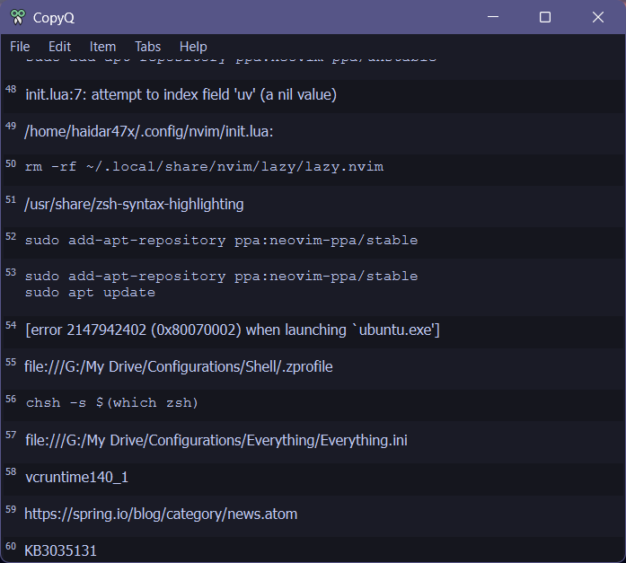

## Tokyo Night for CopyQ

This repository contains Tokyo Night theme for CopyQ clipboard manager.

## Installation

There are two ways to install the theme:

1. Install the theme by copying the `TokyoNight.ini` file to the `themes` directory inside the CopyQ installation directory.
2. Clone this repository and load `TokyoNight.ini` file through the CopyQ settings dialog.

## Contribute

This is an open repository, so feel free to contribute enhancements.
